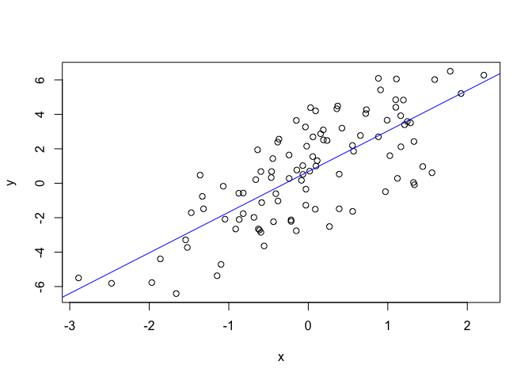
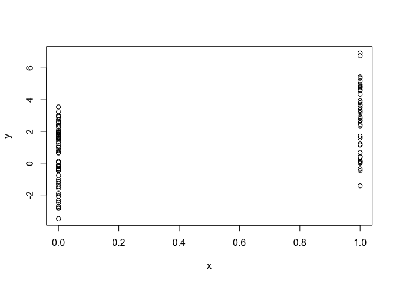
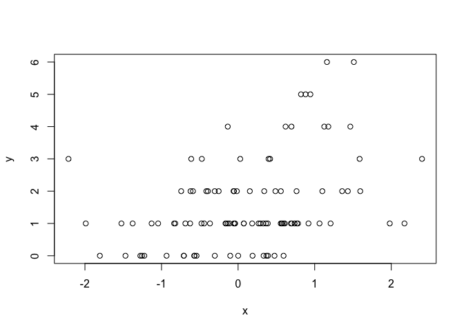
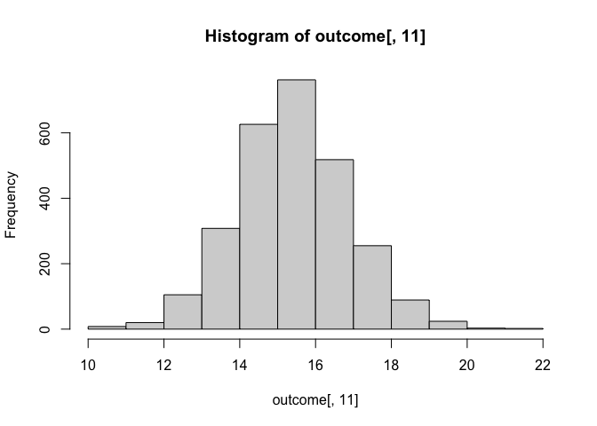

Week 4
================

# Table of Contents

  - **The str Function**

  - **Simulation**
    
      - Generating Random Numbers
      - Simulating a Linear Model
      - Random Sampling

  - **R Profiler**
    
      - Part 1
      - Part 2

  - **Quiz**

  - **Programming Assignment**

  - **Key Takeaway Functions**

# The str Function

`str()`: Compactly display the internal “structure” of an R object

  - A diagnostic function and an alternative to `summary`
  - It is especially well suited to compactly display the (abbreviated)
    contents of (possibly nested) lists
  - Roughly one line per basic object

**What’s in this object?**

``` r
str(str)
```

    ## function (object, ...)

It is a function that takes any object

**Function**

``` r
str(lm)
```

    ## function (formula, data, subset, weights, na.action, method = "qr", model = TRUE, 
    ##     x = FALSE, y = FALSE, qr = TRUE, singular.ok = TRUE, contrasts = NULL, 
    ##     offset, ...)

``` r
str(ls)
```

    ## function (name, pos = -1L, envir = as.environment(pos), all.names = FALSE, 
    ##     pattern, sorted = TRUE)

**Vector**

``` r
x <- rnorm(100, 2, 4)
summary(x)
```

    ##    Min. 1st Qu.  Median    Mean 3rd Qu.    Max. 
    ## -9.3139 -0.9706  1.2752  1.1923  3.5803 10.3877

``` r
str(x)
```

    ##  num [1:100] 3.8361 -0.8588 2.9094 -0.0726 -3.1979 ...

**Factor**

``` r
f <- gl(40, 10)
f
```

    ##   [1] 1  1  1  1  1  1  1  1  1  1  2  2  2  2  2  2  2  2  2  2  3  3  3  3  3 
    ##  [26] 3  3  3  3  3  4  4  4  4  4  4  4  4  4  4  5  5  5  5  5  5  5  5  5  5 
    ##  [51] 6  6  6  6  6  6  6  6  6  6  7  7  7  7  7  7  7  7  7  7  8  8  8  8  8 
    ##  [76] 8  8  8  8  8  9  9  9  9  9  9  9  9  9  9  10 10 10 10 10 10 10 10 10 10
    ## [101] 11 11 11 11 11 11 11 11 11 11 12 12 12 12 12 12 12 12 12 12 13 13 13 13 13
    ## [126] 13 13 13 13 13 14 14 14 14 14 14 14 14 14 14 15 15 15 15 15 15 15 15 15 15
    ## [151] 16 16 16 16 16 16 16 16 16 16 17 17 17 17 17 17 17 17 17 17 18 18 18 18 18
    ## [176] 18 18 18 18 18 19 19 19 19 19 19 19 19 19 19 20 20 20 20 20 20 20 20 20 20
    ## [201] 21 21 21 21 21 21 21 21 21 21 22 22 22 22 22 22 22 22 22 22 23 23 23 23 23
    ## [226] 23 23 23 23 23 24 24 24 24 24 24 24 24 24 24 25 25 25 25 25 25 25 25 25 25
    ## [251] 26 26 26 26 26 26 26 26 26 26 27 27 27 27 27 27 27 27 27 27 28 28 28 28 28
    ## [276] 28 28 28 28 28 29 29 29 29 29 29 29 29 29 29 30 30 30 30 30 30 30 30 30 30
    ## [301] 31 31 31 31 31 31 31 31 31 31 32 32 32 32 32 32 32 32 32 32 33 33 33 33 33
    ## [326] 33 33 33 33 33 34 34 34 34 34 34 34 34 34 34 35 35 35 35 35 35 35 35 35 35
    ## [351] 36 36 36 36 36 36 36 36 36 36 37 37 37 37 37 37 37 37 37 37 38 38 38 38 38
    ## [376] 38 38 38 38 38 39 39 39 39 39 39 39 39 39 39 40 40 40 40 40 40 40 40 40 40
    ## 40 Levels: 1 2 3 4 5 6 7 8 9 10 11 12 13 14 15 16 17 18 19 20 21 22 23 ... 40

``` r
str(f)
```

    ##  Factor w/ 40 levels "1","2","3","4",..: 1 1 1 1 1 1 1 1 1 1 ...

``` r
summary(f) # displays the number of elements in each level
```

    ##  1  2  3  4  5  6  7  8  9 10 11 12 13 14 15 16 17 18 19 20 21 22 23 24 25 26 
    ## 10 10 10 10 10 10 10 10 10 10 10 10 10 10 10 10 10 10 10 10 10 10 10 10 10 10 
    ## 27 28 29 30 31 32 33 34 35 36 37 38 39 40 
    ## 10 10 10 10 10 10 10 10 10 10 10 10 10 10

**Data Frame**

``` r
library(datasets)
head(airquality)
```

    ##   Ozone Solar.R Wind Temp Month Day
    ## 1    41     190  7.4   67     5   1
    ## 2    36     118  8.0   72     5   2
    ## 3    12     149 12.6   74     5   3
    ## 4    18     313 11.5   62     5   4
    ## 5    NA      NA 14.3   56     5   5
    ## 6    28      NA 14.9   66     5   6

``` r
summary(airquality)
```

    ##      Ozone           Solar.R           Wind             Temp      
    ##  Min.   :  1.00   Min.   :  7.0   Min.   : 1.700   Min.   :56.00  
    ##  1st Qu.: 18.00   1st Qu.:115.8   1st Qu.: 7.400   1st Qu.:72.00  
    ##  Median : 31.50   Median :205.0   Median : 9.700   Median :79.00  
    ##  Mean   : 42.13   Mean   :185.9   Mean   : 9.958   Mean   :77.88  
    ##  3rd Qu.: 63.25   3rd Qu.:258.8   3rd Qu.:11.500   3rd Qu.:85.00  
    ##  Max.   :168.00   Max.   :334.0   Max.   :20.700   Max.   :97.00  
    ##  NA's   :37       NA's   :7                                       
    ##      Month            Day      
    ##  Min.   :5.000   Min.   : 1.0  
    ##  1st Qu.:6.000   1st Qu.: 8.0  
    ##  Median :7.000   Median :16.0  
    ##  Mean   :6.993   Mean   :15.8  
    ##  3rd Qu.:8.000   3rd Qu.:23.0  
    ##  Max.   :9.000   Max.   :31.0  
    ## 

``` r
str(airquality)
```

    ## 'data.frame':    153 obs. of  6 variables:
    ##  $ Ozone  : int  41 36 12 18 NA 28 23 19 8 NA ...
    ##  $ Solar.R: int  190 118 149 313 NA NA 299 99 19 194 ...
    ##  $ Wind   : num  7.4 8 12.6 11.5 14.3 14.9 8.6 13.8 20.1 8.6 ...
    ##  $ Temp   : int  67 72 74 62 56 66 65 59 61 69 ...
    ##  $ Month  : int  5 5 5 5 5 5 5 5 5 5 ...
    ##  $ Day    : int  1 2 3 4 5 6 7 8 9 10 ...

**Matrix**

``` r
m <- matrix(rnorm(100), 10, 10)
str(m) # Matrix is a two-dimensional array
```

    ##  num [1:10, 1:10] 0.0472 0.2099 0.0193 0.2592 0.684 ...

``` r
m[, 1]
```

    ##  [1]  0.04723805  0.20990756  0.01925892  0.25918560  0.68395853  0.67006763
    ##  [7] -0.70246228  0.08717999 -0.82993447  1.30476877

**List**

``` r
s <- split(airquality, airquality$Month)
str(s)
```

    ## List of 5
    ##  $ 5:'data.frame':   31 obs. of  6 variables:
    ##   ..$ Ozone  : int [1:31] 41 36 12 18 NA 28 23 19 8 NA ...
    ##   ..$ Solar.R: int [1:31] 190 118 149 313 NA NA 299 99 19 194 ...
    ##   ..$ Wind   : num [1:31] 7.4 8 12.6 11.5 14.3 14.9 8.6 13.8 20.1 8.6 ...
    ##   ..$ Temp   : int [1:31] 67 72 74 62 56 66 65 59 61 69 ...
    ##   ..$ Month  : int [1:31] 5 5 5 5 5 5 5 5 5 5 ...
    ##   ..$ Day    : int [1:31] 1 2 3 4 5 6 7 8 9 10 ...
    ##  $ 6:'data.frame':   30 obs. of  6 variables:
    ##   ..$ Ozone  : int [1:30] NA NA NA NA NA NA 29 NA 71 39 ...
    ##   ..$ Solar.R: int [1:30] 286 287 242 186 220 264 127 273 291 323 ...
    ##   ..$ Wind   : num [1:30] 8.6 9.7 16.1 9.2 8.6 14.3 9.7 6.9 13.8 11.5 ...
    ##   ..$ Temp   : int [1:30] 78 74 67 84 85 79 82 87 90 87 ...
    ##   ..$ Month  : int [1:30] 6 6 6 6 6 6 6 6 6 6 ...
    ##   ..$ Day    : int [1:30] 1 2 3 4 5 6 7 8 9 10 ...
    ##  $ 7:'data.frame':   31 obs. of  6 variables:
    ##   ..$ Ozone  : int [1:31] 135 49 32 NA 64 40 77 97 97 85 ...
    ##   ..$ Solar.R: int [1:31] 269 248 236 101 175 314 276 267 272 175 ...
    ##   ..$ Wind   : num [1:31] 4.1 9.2 9.2 10.9 4.6 10.9 5.1 6.3 5.7 7.4 ...
    ##   ..$ Temp   : int [1:31] 84 85 81 84 83 83 88 92 92 89 ...
    ##   ..$ Month  : int [1:31] 7 7 7 7 7 7 7 7 7 7 ...
    ##   ..$ Day    : int [1:31] 1 2 3 4 5 6 7 8 9 10 ...
    ##  $ 8:'data.frame':   31 obs. of  6 variables:
    ##   ..$ Ozone  : int [1:31] 39 9 16 78 35 66 122 89 110 NA ...
    ##   ..$ Solar.R: int [1:31] 83 24 77 NA NA NA 255 229 207 222 ...
    ##   ..$ Wind   : num [1:31] 6.9 13.8 7.4 6.9 7.4 4.6 4 10.3 8 8.6 ...
    ##   ..$ Temp   : int [1:31] 81 81 82 86 85 87 89 90 90 92 ...
    ##   ..$ Month  : int [1:31] 8 8 8 8 8 8 8 8 8 8 ...
    ##   ..$ Day    : int [1:31] 1 2 3 4 5 6 7 8 9 10 ...
    ##  $ 9:'data.frame':   30 obs. of  6 variables:
    ##   ..$ Ozone  : int [1:30] 96 78 73 91 47 32 20 23 21 24 ...
    ##   ..$ Solar.R: int [1:30] 167 197 183 189 95 92 252 220 230 259 ...
    ##   ..$ Wind   : num [1:30] 6.9 5.1 2.8 4.6 7.4 15.5 10.9 10.3 10.9 9.7 ...
    ##   ..$ Temp   : int [1:30] 91 92 93 93 87 84 80 78 75 73 ...
    ##   ..$ Month  : int [1:30] 9 9 9 9 9 9 9 9 9 9 ...
    ##   ..$ Day    : int [1:30] 1 2 3 4 5 6 7 8 9 10 ...

# Simulation

## Generating Random Numbers

Functions for *probability distributions* in R

  - `rnorm`: generate “**r**andom **norm**al” variates with a given
    *mean* and *standard deviation*
  - `dnorm`: evaluate the “**norm**al probability **d**ensity” (with a
    given mean/SD) at a point (or vector of points)
  - `pnorm`: evaluate the “**cumulative** distribution function” for a
    **norm**al distribution
  - `rpois`: generate **r**andom **pois**son variates with a given rate

*Probability distribution functions* usually have “four” functions
associated with them.  
The functions are prefixed with a:

  - `d` for density
  - `r` for random number generation
  - `p` for cumulative distribution
  - `q` for quantile function

Working with the *normal* distributions requires using these “four”
functions

``` r
# dnorm(x, mean = 0, sd = 1, log = FALSE)
# pnorm(q, mean = 0, sd = 1, lower.tail = TRUE, log.p = FALSE)
# qnorm(p, mean = 0, sd = 1, lower.tail = TRUE, log.p = FALSE)
# rnorm(n, mean = 0, sd = 1)
```

If

is the *cumulative distribution function* for a standard normal
distribution, then `pnorm(q)` =

and `qnorm(p)` =


``` r
x <- rnorm(10)
x
```

    ##  [1]  0.6448143 -1.1132636  0.2952703 -1.3810307  1.2432901 -0.9772492
    ##  [7]  0.0903852 -0.1123754  1.0191912 -0.8322704

``` r
x <- rnorm(10, 20, 2)
x
```

    ##  [1] 18.90352 20.41594 20.51282 21.23871 22.39231 17.45707 17.60113 21.16633
    ##  [9] 20.13324 22.37841

``` r
summary(x)
```

    ##    Min. 1st Qu.  Median    Mean 3rd Qu.    Max. 
    ##   17.46   19.21   20.46   20.22   21.22   22.39

Setting the random number seed with `set.seed` ensures
“reproducibility”  
Always set the random number seed when conducting a simulation\!

#### Normal Random Variables

``` r
set.seed(1)
rnorm(5)
```

    ## [1] -0.6264538  0.1836433 -0.8356286  1.5952808  0.3295078

``` r
set.seed(1)
rnorm(5)
```

    ## [1] -0.6264538  0.1836433 -0.8356286  1.5952808  0.3295078

``` r
rnorm(5)
```

    ## [1] -0.8204684  0.4874291  0.7383247  0.5757814 -0.3053884

``` r
set.seed(1)
rnorm(5)
```

    ## [1] -0.6264538  0.1836433 -0.8356286  1.5952808  0.3295078

``` r
rnorm(5)
```

    ## [1] -0.8204684  0.4874291  0.7383247  0.5757814 -0.3053884

``` r
rnorm(5)
```

    ## [1]  1.5117812  0.3898432 -0.6212406 -2.2146999  1.1249309

#### Poisson Random Variables

``` r
rpois(10, 1)
```

    ##  [1] 1 1 1 0 2 1 2 0 1 1

``` r
rpois(10, 2)
```

    ##  [1] 3 2 3 2 2 3 0 2 3 3

``` r
rpois(10, 29)
```

    ##  [1] 28 28 21 29 27 26 31 28 21 34

``` r
# Cumulative distribution
ppois(2, 2) # Pr(x <= 2)
```

    ## [1] 0.6766764

``` r
ppois(4, 2) # Pr(x <= 4)
```

    ## [1] 0.947347

``` r
ppois(6, 2) # Pr(x <= 6)
```

    ## [1] 0.9954662

## Simulating a Linear Model

Suppose we want to simulate from the following linear model


where
.
Assume
.

``` r
set.seed(20)
x <- rnorm(100)
e <- rnorm(n = 100, mean = 0, sd = 2)

y <- 0.5 + 2 * x + e
summary(y)
```

    ##    Min. 1st Qu.  Median    Mean 3rd Qu.    Max. 
    ## -6.4084 -1.5402  0.6789  0.6893  2.9303  6.5052

``` r
plot(x, y)
abline(lm(y ~ x), col = "blue")
```

<!-- -->

``` r
model <- lm(y ~ x)
summary(model)
```

    ## 
    ## Call:
    ## lm(formula = y ~ x)
    ## 
    ## Residuals:
    ##     Min      1Q  Median      3Q     Max 
    ## -3.9170 -1.3303  0.1328  1.5261  3.6446 
    ## 
    ## Coefficients:
    ##             Estimate Std. Error t value Pr(>|t|)    
    ## (Intercept)   0.6777     0.1983   3.417 0.000922 ***
    ## x             2.3596     0.2013  11.719  < 2e-16 ***
    ## ---
    ## Signif. codes:  0 '***' 0.001 '**' 0.01 '*' 0.05 '.' 0.1 ' ' 1
    ## 
    ## Residual standard error: 1.983 on 98 degrees of freedom
    ## Multiple R-squared:  0.5836, Adjusted R-squared:  0.5793 
    ## F-statistic: 137.3 on 1 and 98 DF,  p-value: < 2.2e-16

What if `x` is binary?

``` r
set.seed(10)
x <- rbinom(n = 100, size = 1, prob = 0.5)
e <- rnorm(n = 100, mean = 0, sd = 2)

y <- 0.5 + 2 * x + e
summary(y)
```

    ##    Min. 1st Qu.  Median    Mean 3rd Qu.    Max. 
    ## -3.4936 -0.1409  1.5767  1.4322  2.8397  6.9410

``` r
plot(x, y)
```

<!-- -->

Suppose we want to simulate from a *Poisson* model where

  
  
and
.  
We need to use the `rpois` function for this

``` r
set.seed(1)
x <- rnorm(100)
log.mu <- 0.5 + 0.3 * x

y <- rpois(100, exp(log.mu))
summary(y)
```

    ##    Min. 1st Qu.  Median    Mean 3rd Qu.    Max. 
    ##    0.00    1.00    1.00    1.55    2.00    6.00

``` r
plot(x, y)
```

<!-- -->

## Random Sampling

The `sample()` function draws randomly from a specified set of (scalar)
objects allowing you to sample from arbitrary distributions.

``` r
set.seed(1)

sample(1:10, 4)
```

    ## [1] 9 4 7 1

``` r
sample(1:10, 4)
```

    ## [1] 2 7 3 6

``` r
sample(letters, 5)
```

    ## [1] "r" "s" "a" "u" "w"

``` r
sample(1:10) # permutation
```

    ##  [1] 10  6  9  2  1  5  8  4  3  7

``` r
sample(1:10)
```

    ##  [1]  5 10  2  8  6  1  4  3  9  7

``` r
sample(1:10, replace = TRUE) # Sample with replacement
```

    ##  [1]  3  6 10 10  6  4  4 10  9  7

# R Profiler

  - “Profiling” is a systematic way to “examine how much time” is spent
    in different parts of a program
  - Useful when trying to “optimize” your code

## Part 1

#### system.time()

  - Takes an arbitrary R expression as input (can be wrapped in curly
    braces) and returns the amount of time taken to evaluate the
    expression
  - Computes the time (*in seconds*) needed to execute an expression
  - Returns an object of class `proc_time`
      - **user time:** time charged to the CPU(s) for this expression
        (for the computer)
      - **elapsed time:** “wall clock” time (for myself)

<!-- end list -->

``` r
# Elapsed time > user time
system.time(readLines("http://www.jhsph.edu"))
```

    ##    user  system elapsed 
    ##   0.021   0.005   1.313

``` r
# The chunk of the time is just spent waiting for the network, or for the data 
# to go over the network and to come back to your computer
```

``` r
# Elapsed time < user time
hilbert <- function(n) {
        i <- 1:n
        1 / outer(i - 1, i, "+")
}

x <- hilbert(1000)
system.time(svd(x))
```

    ##    user  system elapsed 
    ##   2.915   0.029   2.958

Timing longer expressions:

``` r
system.time({
        n <- 1000
        r <- numeric(n)
        for (i in 1:n) {
                x <- rnorm(n)
                r[i] <- mean(x)
        }
})
```

    ##    user  system elapsed 
    ##   0.083   0.005   0.088

## Part 2

#### Rprof()

  - The `Rprof()` function starts the profiler in R
      - R must be complied with profiler support (but this is usually
        the case)
  - The `summaryRprof()` function summarizes the output from `Rprof()`
    (otherwise it’s not readable)
  - DO NOT use `system.time()` and `Rprof()` together or you will be sad
  - `Rprof()` keeps track of the “function call stack” at regularly
    sampled intervals and tabulates how much time is spent in each
    function
  - Default sampling interval is 0.02 seconds
  - NOTE: If your code runs very quickly, the profiler is not useful,
    but then you probably don’t need it in that case

<!-- end list -->

``` r
# lm(y ~ x)

sample.interval=10000
```

  - The `summaryRprof()` function tabulates the R profiler output and
    calculates how much time is spent in which function
  - There are two methods for normalizing the data
  - `by.total` divides the time spent in each function by the total run
    time
  - `by.self` does the same but first subtracts out time spent in
    functions above in the call stack

#### by.total

``` r
# $by.total
#                           total.time         total.pct     self.time        self.pct
# "lm"                            7.41           100.00           0.30            4.05
# "lm.fit"                        3.50            47.23           2.99           40.35
# "model.frame.default"           2.24            30.23           0.12            1.62
# "eval"                          2.24            30.23           0.00            0.00
# "model.frame"                   2.24            30.23           0.00            0.00
# "na.omit"                       1.54            20.78           0.24            3.24
# "na.omit.data.frame"            1.30            17.54           0.49            6.61
# "lapply"                        1.04            14.04           0.00            0.00
# "[.data.frame"                  1.03            13.90           0.79           10.66
# "["                             1.03            13.90           0.00            0.00
# "as.list.data.frame"            0.82            11.07           0.82           11.07
# "as.list"                       0.82            11.07           0.00           11.00
```

#### by.self

Tells you how much time is being spent in a given function, but after
subtracting out all of the other time spent in lower level functions
that it calls.

``` r
# $by.self
#                          self.time          elf.pct     total.time       total.pct
# "lm"                          2.99            40.35           3.50           47.23
# "as.list.data.frame"          0.82            11.07           0.82           11.07
# "[.data.frame"                0.79            10.66           1.03           13.90
# "structure"                   0.73             9.85           0.73            9.85
# "na.omit.data.frame"          0.49             6.61           1.30           17.54
# "list"                        0.46             6.21           0.46            6.21
# "lm"                          0.30             4.05           7.41          100.00
# "model.matrix.default"        0.27             3.64           0.79           10.66
# "na.omit"                     0.24             3.24           1.54           20.78
# "as.character"                0.18             2.43           0.18            2.43
# "model.frame.default"         0.12             1.62           2.24           30.23
# "anyDuplicated.default"       0.02             0.27           0.02            0.27
```

#### summaryRprof() output

Summarizes the output of `Rprof()` and gives “percent of time” spent in
each function (with two types of normalization)

``` r
# $sample.interval
## [1] 0.02

# $sampling.time        # the total amount of time that the expression took to run
## [1] 7.41             # = elapse time
```

# Quiz

## Question 1

**What is produced at the end of this snippet of R code?**

``` r
set.seed(1)
rpois(n = 5, lambda = 2)
```

    ## [1] 1 1 2 4 1

## Question 2

**What R function can be used to generate standard Normal random
variables?** (Answer): `rnorm`

## Question 3

**When simulating data, why is using the `set.seed()` function
important?**  
**Select all that apply.**  
(Answer):  
It ensure that the sequence of random numbers starts in a specific place
and its therefore reproducible.

## Question 4

**Which function can be used to evaluate the inverse cumulative
distribution function for the Poisson distribution?**  
(Answer): `qpois`

## Question 5

**What does the following code do?**

``` r
set.seed(10)
x <- rep(0:1, each = 5)
e <- rnorm(10, 0, 20)
y <- 0.5 + 2 * x + e
```

(Answer): Generate data from a Normal linear model

## Question 6

**What R function can be used to generate Binomial random variables?**  
(Answer): `rbinom()`

## Question 7

**What aspect of the R runtime does the profiler keep track of when an R
expression is evaulated?**  
(Answer): The function call stack

## Question 8

**Consider the following R code**

``` r
library(datasets)
Rprof()
# fit <- lm(y ~ x1 + x2)
Rprof(NULL)
```

**(Assume that y, x1, and x2 are present in the workspace).**  
**Without running the code, what percentage of the run time is spent in
the `lm()` function, based on the `by.total` method of normalization
shown in `summaryRprof()`?**  
(Answer): 100%

## Question 9

**When using `system.time()`, what is the user time?**  
(Answer): It is the time spent by the CPU evaluating an expression

## Question 10

**If a computer has more than one available processor and R is able to
take advantage of that, then which of the following is true when using
`system.time()`?**  
(Answer): Elapsed time may be smaller than user time

# Programming Assignment

``` r
getwd()
```

    ## [1] "/Users/hyeonwooyang/Desktop/Desktop/5_Coursera/1_R_Programming/git_project/1_class_notes"

``` r
setwd("/Users/hyeonwooyang/Desktop/Desktop/5_Coursera/1_R_Programming/git_project/data")
```

## 1\. Plot the 30-day mortality rates for heart attack

``` r
outcome <- read.csv("outcome-of-care-measures.csv", colClasses = "character")
# head(outcome)
# ncol(outcome)
# names(outcome)
# summary(outcome)
str(outcome)
```

    ## 'data.frame':    4706 obs. of  46 variables:
    ##  $ Provider.Number                                                                      : chr  "010001" "010005" "010006" "010007" ...
    ##  $ Hospital.Name                                                                        : chr  "SOUTHEAST ALABAMA MEDICAL CENTER" "MARSHALL MEDICAL CENTER SOUTH" "ELIZA COFFEE MEMORIAL HOSPITAL" "MIZELL MEMORIAL HOSPITAL" ...
    ##  $ Address.1                                                                            : chr  "1108 ROSS CLARK CIRCLE" "2505 U S HIGHWAY 431 NORTH" "205 MARENGO STREET" "702 N MAIN ST" ...
    ##  $ Address.2                                                                            : chr  "" "" "" "" ...
    ##  $ Address.3                                                                            : chr  "" "" "" "" ...
    ##  $ City                                                                                 : chr  "DOTHAN" "BOAZ" "FLORENCE" "OPP" ...
    ##  $ State                                                                                : chr  "AL" "AL" "AL" "AL" ...
    ##  $ ZIP.Code                                                                             : chr  "36301" "35957" "35631" "36467" ...
    ##  $ County.Name                                                                          : chr  "HOUSTON" "MARSHALL" "LAUDERDALE" "COVINGTON" ...
    ##  $ Phone.Number                                                                         : chr  "3347938701" "2565938310" "2567688400" "3344933541" ...
    ##  $ Hospital.30.Day.Death..Mortality..Rates.from.Heart.Attack                            : chr  "14.3" "18.5" "18.1" "Not Available" ...
    ##  $ Comparison.to.U.S..Rate...Hospital.30.Day.Death..Mortality..Rates.from.Heart.Attack  : chr  "No Different than U.S. National Rate" "No Different than U.S. National Rate" "No Different than U.S. National Rate" "Number of Cases Too Small" ...
    ##  $ Lower.Mortality.Estimate...Hospital.30.Day.Death..Mortality..Rates.from.Heart.Attack : chr  "12.1" "14.7" "14.8" "Not Available" ...
    ##  $ Upper.Mortality.Estimate...Hospital.30.Day.Death..Mortality..Rates.from.Heart.Attack : chr  "17.0" "23.0" "21.8" "Not Available" ...
    ##  $ Number.of.Patients...Hospital.30.Day.Death..Mortality..Rates.from.Heart.Attack       : chr  "666" "44" "329" "14" ...
    ##  $ Footnote...Hospital.30.Day.Death..Mortality..Rates.from.Heart.Attack                 : chr  "" "" "" "number of cases is too small (fewer than 25) to reliably tell how well the hospital is performing" ...
    ##  $ Hospital.30.Day.Death..Mortality..Rates.from.Heart.Failure                           : chr  "11.4" "15.2" "11.3" "13.6" ...
    ##  $ Comparison.to.U.S..Rate...Hospital.30.Day.Death..Mortality..Rates.from.Heart.Failure : chr  "No Different than U.S. National Rate" "Worse than U.S. National Rate" "No Different than U.S. National Rate" "No Different than U.S. National Rate" ...
    ##  $ Lower.Mortality.Estimate...Hospital.30.Day.Death..Mortality..Rates.from.Heart.Failure: chr  "9.5" "12.2" "9.1" "10.0" ...
    ##  $ Upper.Mortality.Estimate...Hospital.30.Day.Death..Mortality..Rates.from.Heart.Failure: chr  "13.7" "18.8" "13.9" "18.2" ...
    ##  $ Number.of.Patients...Hospital.30.Day.Death..Mortality..Rates.from.Heart.Failure      : chr  "741" "234" "523" "113" ...
    ##  $ Footnote...Hospital.30.Day.Death..Mortality..Rates.from.Heart.Failure                : chr  "" "" "" "" ...
    ##  $ Hospital.30.Day.Death..Mortality..Rates.from.Pneumonia                               : chr  "10.9" "13.9" "13.4" "14.9" ...
    ##  $ Comparison.to.U.S..Rate...Hospital.30.Day.Death..Mortality..Rates.from.Pneumonia     : chr  "No Different than U.S. National Rate" "No Different than U.S. National Rate" "No Different than U.S. National Rate" "No Different than U.S. National Rate" ...
    ##  $ Lower.Mortality.Estimate...Hospital.30.Day.Death..Mortality..Rates.from.Pneumonia    : chr  "8.6" "11.3" "11.2" "11.6" ...
    ##  $ Upper.Mortality.Estimate...Hospital.30.Day.Death..Mortality..Rates.from.Pneumonia    : chr  "13.7" "17.0" "15.8" "19.0" ...
    ##  $ Number.of.Patients...Hospital.30.Day.Death..Mortality..Rates.from.Pneumonia          : chr  "371" "372" "836" "239" ...
    ##  $ Footnote...Hospital.30.Day.Death..Mortality..Rates.from.Pneumonia                    : chr  "" "" "" "" ...
    ##  $ Hospital.30.Day.Readmission.Rates.from.Heart.Attack                                  : chr  "19.0" "Not Available" "17.8" "Not Available" ...
    ##  $ Comparison.to.U.S..Rate...Hospital.30.Day.Readmission.Rates.from.Heart.Attack        : chr  "No Different than U.S. National Rate" "Number of Cases Too Small" "No Different than U.S. National Rate" "Number of Cases Too Small" ...
    ##  $ Lower.Readmission.Estimate...Hospital.30.Day.Readmission.Rates.from.Heart.Attack     : chr  "16.6" "Not Available" "14.9" "Not Available" ...
    ##  $ Upper.Readmission.Estimate...Hospital.30.Day.Readmission.Rates.from.Heart.Attack     : chr  "21.7" "Not Available" "21.5" "Not Available" ...
    ##  $ Number.of.Patients...Hospital.30.Day.Readmission.Rates.from.Heart.Attack             : chr  "728" "21" "342" "1" ...
    ##  $ Footnote...Hospital.30.Day.Readmission.Rates.from.Heart.Attack                       : chr  "" "number of cases is too small (fewer than 25) to reliably tell how well the hospital is performing" "" "number of cases is too small (fewer than 25) to reliably tell how well the hospital is performing" ...
    ##  $ Hospital.30.Day.Readmission.Rates.from.Heart.Failure                                 : chr  "23.7" "22.5" "19.8" "27.1" ...
    ##  $ Comparison.to.U.S..Rate...Hospital.30.Day.Readmission.Rates.from.Heart.Failure       : chr  "No Different than U.S. National Rate" "No Different than U.S. National Rate" "Better than U.S. National Rate" "No Different than U.S. National Rate" ...
    ##  $ Lower.Readmission.Estimate...Hospital.30.Day.Readmission.Rates.from.Heart.Failure    : chr  "21.3" "19.2" "17.2" "22.4" ...
    ##  $ Upper.Readmission.Estimate...Hospital.30.Day.Readmission.Rates.from.Heart.Failure    : chr  "26.5" "26.1" "22.9" "31.9" ...
    ##  $ Number.of.Patients...Hospital.30.Day.Readmission.Rates.from.Heart.Failure            : chr  "891" "264" "614" "135" ...
    ##  $ Footnote...Hospital.30.Day.Readmission.Rates.from.Heart.Failure                      : chr  "" "" "" "" ...
    ##  $ Hospital.30.Day.Readmission.Rates.from.Pneumonia                                     : chr  "17.1" "17.6" "16.9" "19.4" ...
    ##  $ Comparison.to.U.S..Rate...Hospital.30.Day.Readmission.Rates.from.Pneumonia           : chr  "No Different than U.S. National Rate" "No Different than U.S. National Rate" "No Different than U.S. National Rate" "No Different than U.S. National Rate" ...
    ##  $ Lower.Readmission.Estimate...Hospital.30.Day.Readmission.Rates.from.Pneumonia        : chr  "14.4" "15.0" "14.7" "15.9" ...
    ##  $ Upper.Readmission.Estimate...Hospital.30.Day.Readmission.Rates.from.Pneumonia        : chr  "20.4" "20.6" "19.5" "23.2" ...
    ##  $ Number.of.Patients...Hospital.30.Day.Readmission.Rates.from.Pneumonia                : chr  "400" "374" "842" "254" ...
    ##  $ Footnote...Hospital.30.Day.Readmission.Rates.from.Pneumonia                          : chr  "" "" "" "" ...

``` r
outcome[, 11] <- as.numeric(outcome[, 11])
```

    ## Warning: NAs introduced by coercion

``` r
hist(outcome[, 11])
```

<!-- -->

## 2\. Finding the best hospital in a state

``` r
best <- function(state, outcome) {
        ## Read outcome data
        data <- read.csv("outcome-of-care-measures.csv", colClasses = "character")
        a <- split(data, data[, "State"])
        
        ## Check that state and outcome are valid
        if (!state %in% names(a)) {
                return(paste("Error in best(", state, ", ", outcome, ") : invalid state", sep = ""))
        }
        else if (!outcome %in% c("heart attack", "heart failure", "pneumonia")) {
                return(paste("Error in best(", state, ", ", outcome, ") : invalid outcome", sep = ""))
        }
        
        ## Return hospital name in that state with lowest 30-day death
        ## rate
        b <- a[[state]]
        
        x <- b[, "Hospital.Name"]
        
        if (outcome == "heart attack") {
                c <- 11
        }
        else if (outcome == "heart failure") {
                c <- 17
        }
        else {
                c <- 23
        }
        y <- as.numeric(b[, c])

        combine <- data.frame(x, y)

        good <- complete.cases(x, y)
        newdata <- combine[good, ]

        order <- newdata[order(newdata[, 2], newdata[, 1]), ]
        # = newdata[with(newdata, order(y, x)), ]

        ans <- unname(order[1, 1])
        
        return(ans)
}
```

``` r
dump("best", file = "best.R")
```

``` r
rm(list = ls())
source("best.R")
```

``` r
best("TX", "heart attack")
```

    ## [1] "CYPRESS FAIRBANKS MEDICAL CENTER"

``` r
best("TX", "heart failure")
```

    ## [1] "FORT DUNCAN MEDICAL CENTER"

``` r
best("MD", "heart attack")
```

    ## [1] "JOHNS HOPKINS HOSPITAL, THE"

``` r
best("MD", "pneumonia")
```

    ## [1] "GREATER BALTIMORE MEDICAL CENTER"

``` r
best("BB", "heart attack")
```

    ## [1] "Error in best(BB, heart attack) : invalid state"

``` r
best("NY", "hert attack")
```

    ## [1] "Error in best(NY, hert attack) : invalid outcome"

## 3\. Ranking hospitals by outcome in a state

``` r
rankhospital <- function(state, outcome, num = "best") {
        ## Read outcome data
        data <- read.csv("outcome-of-care-measures.csv", colClasses = "character")
        a <- split(data, data[, "State"])
        
        ## Check that state and outcome are valid
        if (!state %in% names(a)) {
                return(paste("Error in best(", state, ", ", outcome, ") : invalid state", sep = ""))
                # stop(paste("Error in best(", state, ", ", outcome, ") : invalid state", sep = ""))
        }
        else if (!outcome %in% c("heart attack", "heart failure", "pneumonia")) {
                return(paste("Error in best(", state, ", ", outcome, ") : invalid outcome", sep = ""))
                # stop(paste("Error in best(", state, ", ", outcome, ") : invalid outcome", sep = ""))
        }
        
        ## Return hospital name in that state with the given rank
        ## 30-day death rate
        b <- a[[state]]
        
        x <- b[, "Hospital.Name"]
        
        if (outcome == "heart attack") {
                c <- 11
        }
        else if (outcome == "heart failure") {
                c <- 17
        }
        else {
                c <- 23
        }
        y <- as.numeric(b[, c])

        combine <- data.frame(x, y)
        colnames(combine) <- c("Hospital.Name", "Rate")

        good <- complete.cases(x, y)
        newdata <- combine[good, ]
        
        order <- newdata[order(newdata[, 2], newdata[, 1]), ]
        # = newdata[with(newdata, order(y, x)), ]

        order$Rank <- 1:nrow(order)
        
        if (num == "best") {
                ans <- unname(order[1, 1])
        }
        else if (num == "worst") {
                ans <- unname(order[nrow(order), 1])
        }
        else if (num > nrow(order)) {
                ans <- NA
        }
        else {
              ans <- unname(order[num, 1])  
        }
        return(ans)
}
```

``` r
dump("rankhospital", file = "rankhospital.R")
```

``` r
source("rankhospital.R")
rankhospital("TX", "heart failure", 4)
```

    ## [1] "DETAR HOSPITAL NAVARRO"

``` r
rankhospital("MD", "heart attack", "worst")
```

    ## [1] "HARFORD MEMORIAL HOSPITAL"

``` r
rankhospital("MN", "heart attack", 5000)
```

    ## [1] NA

## 4\. Ranking hospitals in all states

``` r
rankall <- function(outcome, num = "best") {
        ## Read outcome data
        data <- read.csv("outcome-of-care-measures.csv", colClasses = "character")
        a <- split(data, data[, "State"])
        
        ## Check that outcome is valid
        if (!outcome %in% c("heart attack", "heart failure", "pneumonia")) {
                return(paste("Error in best(", state, ", ", outcome, ") : invalid outcome", sep = ""))
                # stop(paste("Error in best(", state, ", ", outcome, ") : invalid outcome", sep = ""))
        }
        
        ## For each state, find the hospital of the given rank
        if (outcome == "heart attack") {
                c <- 11
        }
        else if (outcome == "heart failure") {
                c <- 17
        }
        else {
                c <- 23
        }
                
        zList <- lapply(a, function(df) {
                        x <- df[, "Hospital.Name"]
                        y <- as.numeric(df[, c])
                
                        combine <- data.frame(x, y)
                        colnames(combine) <- c("Hospital.Name", "Rate")
                
                        good <- complete.cases(x, y)
                        newdata <- combine[good, ]
                
                        order <- newdata[order(newdata[, 2], newdata[, 1]), ]
                        # = newdata[with(newdata, order(y, x)), ]
                
                        order$Rank <- 1:nrow(order)
                
                        if (num == "best") {
                                ans <- unname(order[1, 1])
                        }
                        else if (num == "worst") {
                                ans <- unname(order[nrow(order), 1])
                        }
                        else if (num > nrow(order)) {
                                ans <- NA
                        }
                        else {
                                ans <- unname(order[num, 1])  
                        }
                        return(ans)
                })
        
        ## Return a data frame with the hospital names and the
        ## (abbreviated) state name
        df2 <- data.frame()
        
        for (i in seq_along(zList)) {
                z <- c(zList[[i]], names(zList[i]))
                df2 <- rbind(df2, z)
        }
        
        colnames(df2) <- c("hospital", "state")
        return(df2)
}
```

``` r
dump("rankall", file = "rankall.R")
```

``` r
source("rankall.R")
head(rankall("heart attack", 20), 10)
```

    ##                               hospital state
    ## 1                                 <NA>    AK
    ## 2       D W MCMILLAN MEMORIAL HOSPITAL    AL
    ## 3    ARKANSAS METHODIST MEDICAL CENTER    AR
    ## 4  JOHN C LINCOLN DEER VALLEY HOSPITAL    AZ
    ## 5                SHERMAN OAKS HOSPITAL    CA
    ## 6             SKY RIDGE MEDICAL CENTER    CO
    ## 7              MIDSTATE MEDICAL CENTER    CT
    ## 8                                 <NA>    DC
    ## 9                                 <NA>    DE
    ## 10      SOUTH FLORIDA BAPTIST HOSPITAL    FL

``` r
tail(rankall("pneumonia", "worst"), 3)
```

    ##                                      hospital state
    ## 52 MAYO CLINIC HEALTH SYSTEM - NORTHLAND, INC    WI
    ## 53                     PLATEAU MEDICAL CENTER    WV
    ## 54           NORTH BIG HORN HOSPITAL DISTRICT    WY

``` r
tail(rankall("heart failure"), 10)
```

    ##                                                             hospital state
    ## 45                         WELLMONT HAWKINS COUNTY MEMORIAL HOSPITAL    TN
    ## 46                                        FORT DUNCAN MEDICAL CENTER    TX
    ## 47 VA SALT LAKE CITY HEALTHCARE - GEORGE E. WAHLEN VA MEDICAL CENTER    UT
    ## 48                                          SENTARA POTOMAC HOSPITAL    VA
    ## 49                            GOV JUAN F LUIS HOSPITAL & MEDICAL CTR    VI
    ## 50                                              SPRINGFIELD HOSPITAL    VT
    ## 51                                         HARBORVIEW MEDICAL CENTER    WA
    ## 52                                    AURORA ST LUKES MEDICAL CENTER    WI
    ## 53                                         FAIRMONT GENERAL HOSPITAL    WV
    ## 54                                        CHEYENNE VA MEDICAL CENTER    WY

## Programming Assignment Quiz

## Question 1

``` r
best("SC", "heart attack")
```

    ## [1] "MUSC MEDICAL CENTER"

## Question 2

``` r
best("NY", "pneumonia")
```

    ## [1] "MAIMONIDES MEDICAL CENTER"

## Question 3

``` r
best("AK", "pneumonia")
```

    ## [1] "YUKON KUSKOKWIM DELTA REG HOSPITAL"

## Question 4

``` r
rankhospital("NC", "heart attack", "worst")
```

    ## [1] "WAYNE MEMORIAL HOSPITAL"

## Question 5

``` r
rankhospital("WA", "heart attack", 7)
```

    ## [1] "YAKIMA VALLEY MEMORIAL HOSPITAL"

## Question 6

``` r
rankhospital("TX", "pneumonia", 10)
```

    ## [1] "SETON SMITHVILLE REGIONAL HOSPITAL"

## Question 7

``` r
rankhospital("NY", "heart attack", 7)
```

    ## [1] "BELLEVUE HOSPITAL CENTER"

## Question 8

``` r
r <- rankall("heart attack", 4)
as.character(subset(r, state == "HI")$hospital)
```

    ## [1] "CASTLE MEDICAL CENTER"

## Question 9

``` r
r <- rankall("pneumonia", "worst")
as.character(subset(r, state == "NJ")$hospital)
```

    ## [1] "BERGEN REGIONAL MEDICAL CENTER"

## Question 10

``` r
r <- rankall("heart failure", 10)
as.character(subset(r, state == "NV")$hospital)
```

    ## [1] "RENOWN SOUTH MEADOWS MEDICAL CENTER"

# Key Takeaway Functions

  - **The str Function**
      - *str()*
      - *gl(levels, repeat)*
  - **Simulation**
      - Generating Random Numbers
          - *``*
          - *rnorm(n, mean = 0, sd = 1)*
          - *rnorm(), dnorm(), pnorm(), rpois()*
          - *set.seed()*
      - Simulating a Linear Model
          - *rbinorm()*
          - *plot(x, y); abline(lm(y \~ x), col = “blue”)*
          - *summary(lm(y \~ x))*
      - Random Sampling
          - *sample()*
  - **R Profiler**
      - *system.time()*
      - *Rprof(), summaryRprof(), by.total, by.self*
      - *sample.internal*
  - **Programming Assignment**
      - *hist()*
      - *element %in% vector*
      - *vector\[order(vector\[, 1\]), \]*
      - *vector\[order(vector\[, 2\], vector\[, 1\]), \]*
      - *names(df)*
      - *unname(matrix\[1, 1\])*
      - *stop()*
      - *colnames(df)*
      - *df$new\_column \<-*
      - *for (i in seq\_along(vector))*

`ctrl` + `shift` + `c`

<https://www.stat.cmu.edu/~cshalizi/rmarkdown/#math-in-r-markdown>  
<https://bookdown.org/yihui/rmarkdown/html-document.html#mathjax-equations>  
<https://gist.github.com/a-rodin/fef3f543412d6e1ec5b6cf55bf197d7b>  
<https://rpruim.github.io/s341/S19/from-class/MathinRmd.html>

<https://chartio.com/resources/tutorials/how-to-sort-a-data-frame-by-multiple-columns-in-r/>
